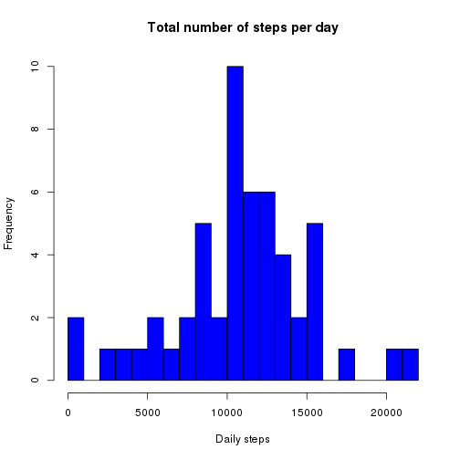
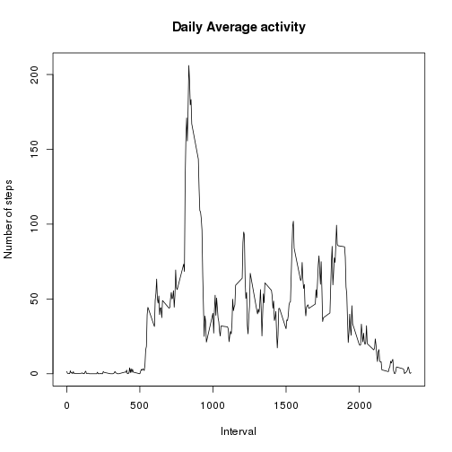
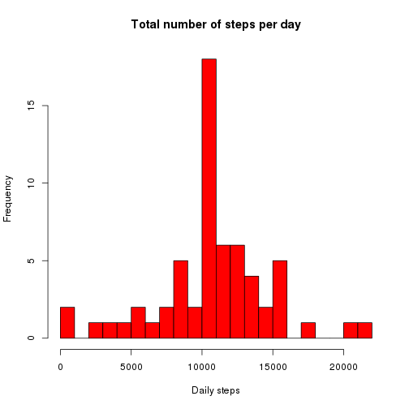
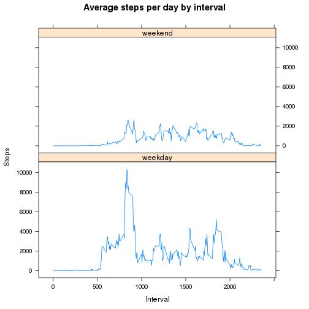

## Loading and preprocessing the data

#### 1. Load the data (i.e. `read.csv()`)

Note that the data is moved to the data/ directory.


```r
if (!file.exists('data/activity.csv')) {
  unzip('data/activity.zip', exdir = 'data')
} 

activity <- read.csv('data/activity.csv')
```
#### 2. Process/transform the data (if necessary) into a format suitable
for your analysis

Clean data by removing NAs.


```r
activity <- na.omit(activity)
```

## What is mean total number of steps taken per day?

#### 1. Calculate the total number of steps taken per day


```r
steps.day <- aggregate(steps ~ date, data = activity, FUN=sum)
names(steps.day) <- c("date", "steps_count")
```

#### 2. Make a histogram of the total number of steps taken each day

Histogram

```r
hist(steps.day$steps_count,
  col='blue',
  breaks=20,
  main='Total number of steps per day',
  xlab='Daily steps')
```

 

#### 3. Calculate and report the mean and median of the total number of steps taken per day


```r
mean(steps.day$steps_count)
```

```
## [1] 10766.19
```

```r
median(steps.day$steps_count)
```

```
## [1] 10765
```

## What is the average daily activity pattern?

### Make a time series plot

1. Make a time series plot (i.e. type = "l") of the 5-minute interval
(x-axis) and the average number of steps taken, averaged across all
days (y-axis)


```r
steps.daily <- aggregate(steps ~ interval, data = activity, mean);
plot(steps.daily$interval, steps.daily$steps, type='l', xlab='Interval', ylab='Number of steps', main='Daily Average activity')
```

 
#### 2. Which 5-minute interval, on average across all the days in the dataset, contains the maximum number of steps?


```r
max_num_of_steps <- steps.daily[which.max(steps.daily$steps),1]
max_num_of_steps
```

```
## [1] 835
```

#### 3. Find interval with most average steps.


```r
steps.daily[steps.daily$interval == max_num_of_steps,]$steps
```

```
## [1] 206.1698
```

## Imputing missing values

Reread activity with NA's


```r
activity <- read.csv('data/activity.csv')
```

#### 1. Calculate and report the total number of missing values in the dataset (i.e. the total number of rows with NAs)

The total number of missing values is:


```r
activity_na <- sum(!complete.cases(activity))
activity_na
```

```
## [1] 2304
```

#### 2. Devise a strategy

Devise a strategy for filling in all of the missing values in the
dataset. The strategy does not need to be sophisticated. For example,
you could use the mean/median for that day, or the mean for that
5-minute interval, etc.

The average of the interval is used for the NA.

#### 3. Create a new dataset that is equal to the original dataset but with the missing data filled in.


```r
activity.imputed <- transform(activity, steps = ifelse(is.na(activity$steps), steps_by_interval$steps[match(activity$interval, steps.daily$interval)], activity$steps))
```

```
## Error in ifelse(is.na(activity$steps), steps_by_interval$steps[match(activity$interval, : object 'steps_by_interval' not found
```

#### 4. Make a histogram of the total number of steps taken each day


```r
steps_imputed.day <- aggregate(steps ~ date, data = activity.imputed, FUN=sum)
names(steps_imputed.day) <- c("date", "steps_count")
hist(steps_imputed.day$steps_count,
  col='red',
  breaks=20,
  main='Total number of steps per day',
  xlab='Daily steps')
```

 

#### Calculate and report the mean and median total number of steps taken
per day. Do these values differ from the estimates from the first part
of the assignment? What is the impact of imputing missing data on the
estimates of the total daily number of steps?


```r
mean(steps_imputed.day$steps_count)
```

```
## [1] 10766.19
```

```r
median(steps_imputed.day$steps_count)
```

```
## [1] 10766.19
```

## Are there differences in activity patterns between weekdays and weekends?

For this part the weekdays() function may be of some help here. Use
the dataset with the filled-in missing values for this part.

1.Create a new factor variable in the dataset with two levels –
“weekday” and “weekend” indicating whether a given date is a weekday
or weekend day.


```r
weekdays <- c("Monday", "Tuesday", "Wednesday", "Thursday", "Friday")
activity.imputed$dow = as.factor(ifelse(is.element(weekdays(as.Date(activity.imputed$date)),weekdays), "weekday", "weekend"))
summary(activity.imputed$dow)
```

```
## weekday weekend 
##   12960    4608
```

#### Plot

2.Make a panel plot containing a time series plot (i.e. type = "l")
of the 5-minute interval (x-axis) and the average number of steps
taken, averaged across all weekday days or weekend days (y-axis). See
the README file in the GitHub repository to see an example of what
this plot should look like using simulated data.


```r
steps_imputed.interval <- aggregate(steps ~ interval + dow, data = activity.imputed, FUN=sum)
library(lattice)
xyplot(steps_imputed.interval$steps ~ steps_imputed.interval$interval|steps_imputed.interval$dow,
  main='Average steps per day by interval',
  xlab='Interval',
  ylab='Steps',
  layout=c(1,2),
  type="l")
```

 
